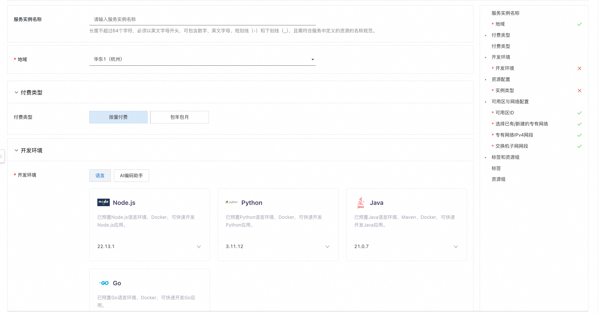
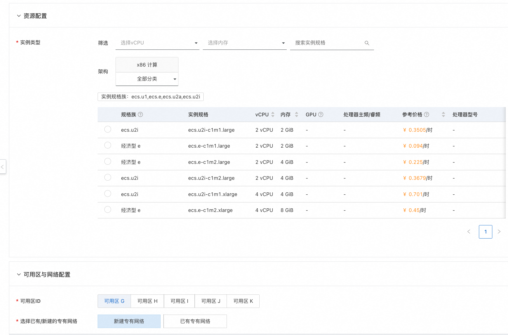
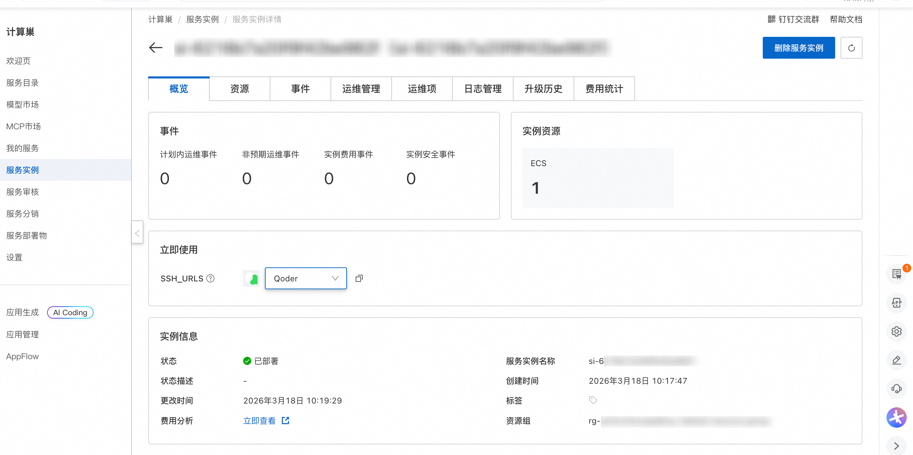
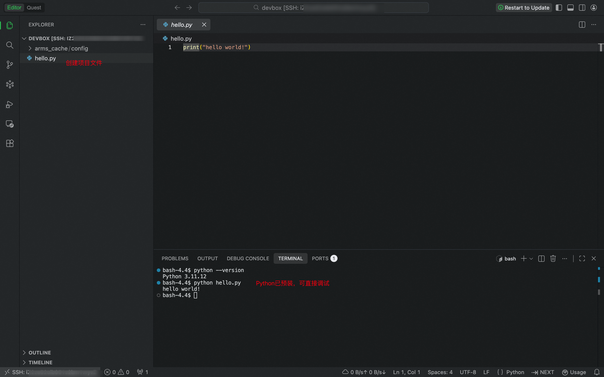

## Introduction to ECS Devbox

ECS Devbox is a fast development environment built on ECS instances. It helps you quickly launch the development environments your projects need (such as Python, Java, and other common languages, frameworks, and tools), and lets you develop remotely using your familiar local IDE (such as VSCode).

Simplify environment setup, focus on writing code, and start developing right away!

 

## Why Choose ECS Devbox

- **Fast development startup**: Quickly set up development environments and avoid the tedious process of configuring dependencies locally.

- **Keep your development habits**: Continue developing with your familiar local IDE, and connect to the cloud development environment remotely with one click.

- **Pay-as-you-go support**: As low as about CNY 0.1 per hour; use it anytime and release it anytime.

- **AI-assisted programming**: Integrated with AI assistants such as opencode, providing an AI development environment.

- **Shared development environments**: Multiple team members can share a Devbox, simplifying collaboration.

 

## Creation Process

1. Visit the Compute Nest ECS DevBox [deployment link](https://computenest.console.aliyun.com/service/instance/create/cn-hangzhou?type=user&ServiceId=service-f3177ab37b6449339ea3) and fill in the deployment parameters as prompted on the page:
   
   The development environment section provides commonly used environments; choose one based on your project needs. (This article uses Python as an example.)
   
   In the resource configuration section, you can select the appropriate ECS instance type as needed.
   
   
   
   

2. After the parameters are configured, the system will automatically generate a **cost estimate breakdown**. After confirming everything is correct, click **Next: Confirm Order**.

3. On the order confirmation page, verify the instance information and costs, then click **Create Now** to start the automatic deployment.

4. After the deployment is complete, get the access URL in the **Use Now section**:
   
   You can switch to your preferred IDE editor; here we use [Qoder](https://qoder.com/en/ide) as an example. (Please install the local IDE in advance.)
   
   

5. Copy the access URL into your browser's address bar and press Enter. The corresponding local IDE will launch automatically and connect to the current DevBox. (The first connection may take a bit longer; please be patient.)

6. Once connected, you can start developing with your local IDE. Create your project files—the corresponding environment is already pre-installed.
   
   
