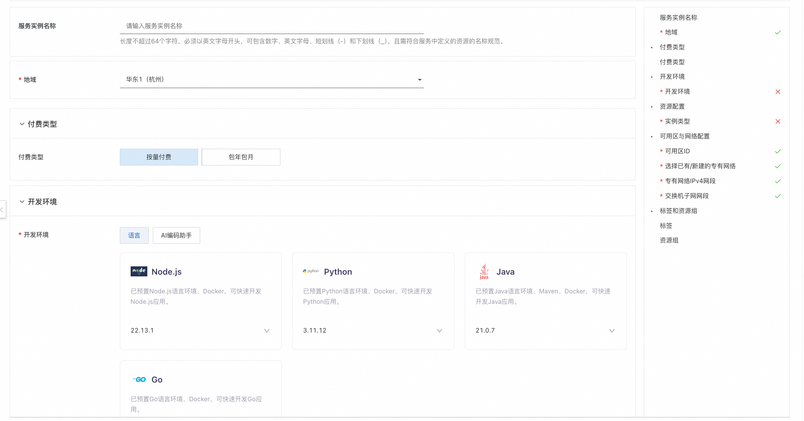
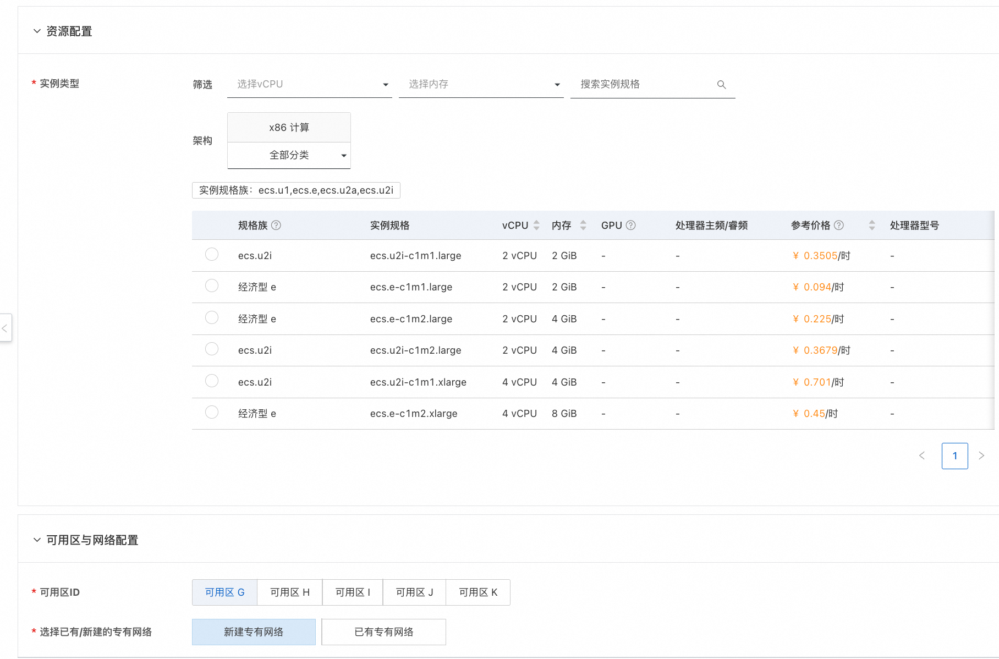
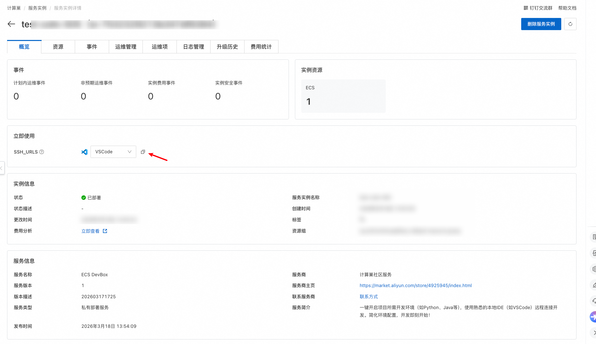
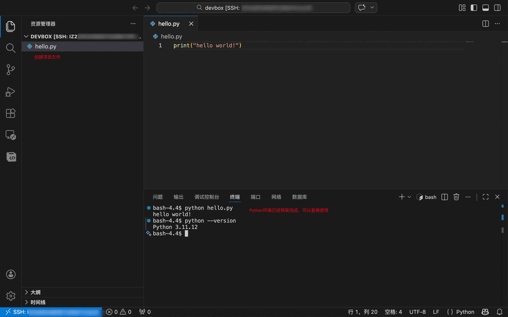

## ECS Devbox 服务简介

ECS Devbox是基于ECS实例创建的快速开发环境。帮助您快速启动项目所需开发环境（如Python、Java等常用语言、框架、工具），使用熟悉的本地IDE（如VSCode）远程连接开发。

简化环境配置，专注写代码，开发即刻开始！

## 为什么选ECS Devbox

- **快速启动开发**：快速搭建开发环境，避免本地配置依赖的繁琐过程。

- **保持开发习惯**：仍使用熟悉的本地IDE开发，一键远程连接云端开发环境。

- **支持按量付费**：每小时低至约0.1元，随时使用随时释放。

- **AI 辅助编程**：集成opencode等AI助手，提供AI开发环境。

- **开发环境共享**：团队内多人可共享Devbox，简化协作流程。

## 创建流程

1. 访问计算巢ECS DevBox部署链接，按照页面填写部署参数：
   
   开发环境部分提供了常用的环境，您可按照项目需要选择。（本文以Python为例）
   
   资源配置部分，您可按需选择合适的ECS规格。
   
   
   
   

2. 参数配置完成后，系统将自动生成**费用预估明细**。确认无误后点击 **下一步：确认订单**。

3. 在订单确认页，核对实例信息与费用，点击 **立即创建** 开始自动部署。

4. 部署完成后在立即使用栏获取访问地址：
   
   您可以切换熟悉的IDE编辑器，这里以VSCode为例。（请提前安装本地IDE）
   
   

5. 将访问地址复制到浏览器地址栏，点击回车。相应的本地IDE会自动启动，并连接当前DevBox。（首次连接会稍慢一些，请耐心等待）

6. 连接完成后，您可以使用本地IDE开始开发。创建您的项目文件，相应的环境已经预装好。
   
   

